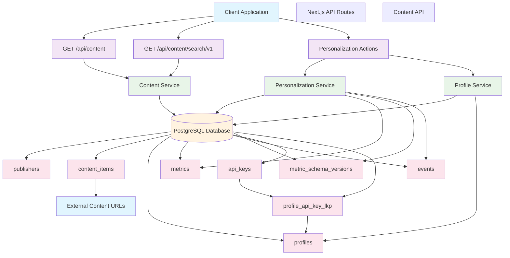

# Content Proxy Data Architecture

## Overview

The Content Proxy application manages educational content from multiple publishers while tracking user interactions for personalization. This document describes the data architecture, database schemas, and data flows within the system.

## Database Schema

### Content Management Tables

#### `publishers`

Stores information about content publishers/organizations.

| Field        | Type         | Description                                               |
| ------------ | ------------ | --------------------------------------------------------- |
| `id`         | VARCHAR(12)  | Unique identifier (hex string from `openssl rand -hex 6`) |
| `name`       | VARCHAR(100) | Publisher name (e.g., "Austin Christian University")      |
| `created_at` | TIMESTAMP    | Record creation timestamp                                 |
| `updated_at` | TIMESTAMP    | Last update timestamp                                     |

#### `content_items`

Stores individual content items (articles, videos, audio) with metadata.

| Field               | Type         | Description                                  |
| ------------------- | ------------ | -------------------------------------------- |
| `id`                | VARCHAR(12)  | Unique identifier (UUID v4)                  |
| `publisher_id`      | VARCHAR(12)  | Foreign key to publishers table              |
| `type`              | VARCHAR(10)  | Content type: "article", "video", or "audio" |
| `name`              | VARCHAR(200) | Content title/name                           |
| `short_description` | VARCHAR(500) | Brief description of content                 |
| `thumbnail_url`     | VARCHAR(500) | URL to thumbnail image                       |
| `content_url`       | VARCHAR(500) | URL to actual content                        |
| `created_at`        | TIMESTAMP    | Record creation timestamp                    |
| `updated_at`        | TIMESTAMP    | Last update timestamp                        |

### Personalization & Analytics Tables

#### `profiles`

Stores user profile information for personalization.

| Field        | Type         | Description                                      |
| ------------ | ------------ | ------------------------------------------------ |
| `id`         | UUID         | Unique identifier (UUID v4)                      |
| `first_name` | VARCHAR(255) | User's first name                                |
| `last_name`  | VARCHAR(255) | User's last name                                 |
| `email`      | VARCHAR(255) | User's email address                             |
| `type`       | VARCHAR(255) | Profile type (individual, organization, service) |
| `client_ip`  | VARCHAR(39)  | Client IP address (IPv4/IPv6)                    |
| `created_at` | TIMESTAMP    | Record creation timestamp                        |
| `updated_at` | TIMESTAMP    | Last update timestamp                            |

#### `metrics`

Defines available metric types for tracking user behavior.

| Field  | Type         | Description                          |
| ------ | ------------ | ------------------------------------ |
| `name` | VARCHAR(255) | Metric name (e.g., "viewed_content") |

#### `metric_schema_versions`

Stores JSON schema versions for metric validation.

| Field         | Type         | Description                       |
| ------------- | ------------ | --------------------------------- |
| `id`          | UUID         | Unique identifier (UUID v4)       |
| `metric_name` | VARCHAR(255) | Foreign key to metrics table      |
| `revision`    | VARCHAR(36)  | Semantic version (e.g., "v1.0.0") |
| `schema`      | JSONB        | JSON schema for metric validation |
| `created_at`  | TIMESTAMP    | Record creation timestamp         |
| `updated_at`  | TIMESTAMP    | Last update timestamp             |

#### `events`

Stores user interaction events for analytics and personalization.

| Field                      | Type      | Description                                 |
| -------------------------- | --------- | ------------------------------------------- |
| `id`                       | UUID      | Unique identifier (UUID v4)                 |
| `profile_id`               | UUID      | Foreign key to profiles table               |
| `metric_schema_version_id` | UUID      | Foreign key to metric_schema_versions table |
| `data`                     | JSONB     | Event-specific data payload                 |
| `ts`                       | TIMESTAMP | Event timestamp                             |

### API Security Tables

#### `api_keys`

Manages API keys for authentication.

| Field         | Type          | Description                                            |
| ------------- | ------------- | ------------------------------------------------------ |
| `id`          | UUID          | Unique identifier (UUID v4)                            |
| `key`         | VARCHAR(64)   | API key value (hex string from `openssl rand -hex 32`) |
| `name`        | VARCHAR(255)  | Human-readable name for the API key                    |
| `description` | VARCHAR(1000) | Optional description of purpose                        |
| `created_at`  | TIMESTAMP     | Record creation timestamp                              |
| `updated_at`  | TIMESTAMP     | Last update timestamp                                  |

#### `profile_api_key_lkp`

Many-to-many relationship between profiles and API keys.

| Field        | Type      | Description                   |
| ------------ | --------- | ----------------------------- |
| `profile_id` | UUID      | Foreign key to profiles table |
| `api_key_id` | UUID      | Foreign key to api_keys table |
| `created_at` | TIMESTAMP | Record creation timestamp     |
| `updated_at` | TIMESTAMP | Last update timestamp         |

## Data Flows

### Content Retrieval Flow

1. **Client Request** → API endpoints (`/api/content`, `/api/content/search/v1`)
2. **Database Query** → Content service queries `content_items` with `publishers` join
3. **Response** → Returns paginated content with publisher information

### Personalization Flow

1. **User Interaction** → Client triggers `emitViewedContentEvent`
2. **Profile Management** → `upsertProfile` creates/updates user profile
3. **Event Validation** → Validates event data against JSON schema
4. **Event Storage** → Stores validated event in `events` table
5. **Schema Versioning** → Tracks metric schema versions for compatibility

### Search Flow

1. **Search Query** → Client sends search term to `/api/content/search/v1`
2. **Full-Text Search** → Database performs ILIKE search on `name` and `short_description`
3. **Results** → Returns matching content items with publisher information

## Data Architecture Diagram



## Key Features

### Content Management

- **Multi-publisher Support**: Content from multiple educational institutions
- **Content Types**: Articles, videos, and audio content
- **Rich Metadata**: Titles, descriptions, thumbnails, and content URLs
- **Search Capabilities**: Full-text search across content names and descriptions

### Personalization & Analytics

- **User Profiles**: Track individual users with optional personal information
- **Event Tracking**: Structured event system with JSON schema validation
- **Schema Versioning**: Support for evolving metric schemas over time
- **IP Tracking**: Optional client IP tracking for analytics

### Security & Access Control

- **API Key Management**: Secure API authentication with key rotation
- **Profile-Key Relationships**: Many-to-many mapping between profiles and API keys
- **Input Validation**: JSON schema validation for all tracked events

## Data Relationships

- **One-to-Many**: Publishers → Content Items
- **One-to-Many**: Profiles → Events
- **One-to-Many**: Metrics → Metric Schema Versions
- **One-to-Many**: Metric Schema Versions → Events
- **Many-to-Many**: Profiles ↔ API Keys (via profile_api_key_lkp)

## Usage Examples

### Content Retrieval

```typescript
// Get paginated content
const content = await listContentWithPublishersPaginated(1, 10);

// Search content
const results = await searchContentItemsWithPublishers('theology', 5);
```

### Personalization Events

```typescript
// Track content view
await emitViewedContentEvent(profileId, {
  contentItemId: '72f20c838bb0',
  url: 'https://christianed.com/courses/biblical-theology',
});
```

### Profile Management

```typescript
// Create or update profile
const profile = await upsertProfile({
  id: '550e8400-e29b-41d4-a716-446655440000',
  firstName: 'John',
  lastName: 'Doe',
  email: 'john.doe@example.com',
});
```

## Technology Stack

- **Database**: PostgreSQL with Drizzle ORM
- **Backend**: Next.js with TypeScript
- **API**: RESTful API with JSON responses
- **Validation**: JSON Schema for event data validation
- **Search**: Database-level ILIKE search with word matching
